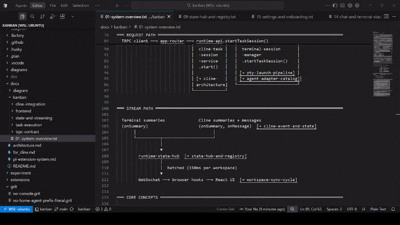
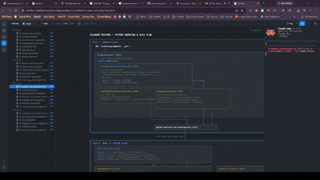

## Demo
1. Extension 
-> lives inside extensions/diagfren
-> Demo: install extension in vscode and then open docs/kanban/01-system-overview.txt; this is the entry diagram to a set of linked diagrams in the folder. You should see highlighted links that can be jumped to via ctrl + lclick

2. Web Application (Original)
-> this is built into the kanban application itself
-> Demo: build kanban normally and start it in this folder. Then navigate to <host>/kanban/?view=diagram&path=ascii3%2F04-overlayer-and-scene.html to see it
